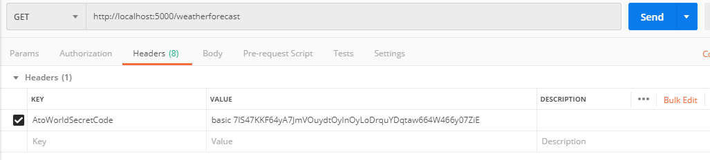
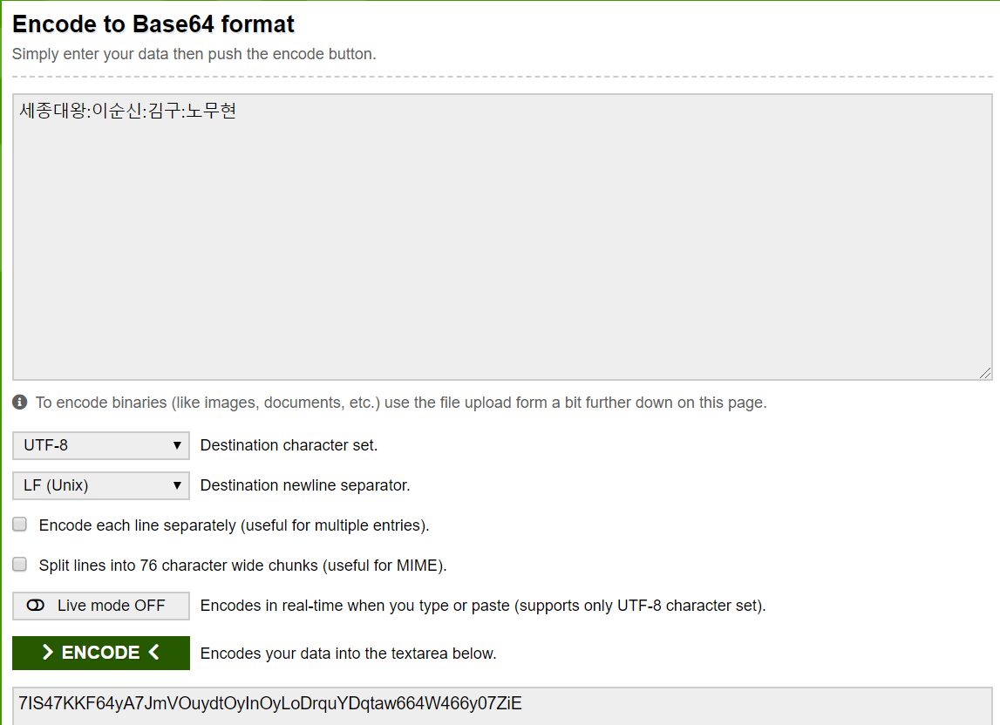
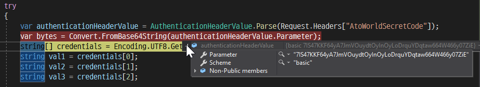
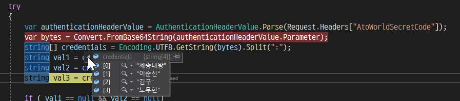

Header Token을 이용한 간단한 인증 보안
======================
- Api_key, Secret_key와 같은 간단한 인증을 사용하는 rest service
- 로그인한 사이트에서 발급된 키가 있어야 rest service를 사용하도록 합니다.

## BasicAuthenticatonHandler 구현
```
public class BasicAuthenticationHandler : AuthenticationHandler<AuthenticationSchemeOptions>
    {
        public BasicAuthenticationHandler(IOptionsMonitor<AuthenticationSchemeOptions> options,
                                          ILoggerFactory logger,
                                          UrlEncoder encoder,
                                          ISystemClock clock) : base(options, logger, encoder, clock)
        {

        }

        protected override Task<AuthenticateResult> HandleAuthenticateAsync()
        {
            if (!Request.Headers.ContainsKey("AtoWorldSecretCode"))
                return Task.FromResult(AuthenticateResult.Fail("Authentication header was not found"));

            try
            {
                var authenticationHeaderValue = AuthenticationHeaderValue.Parse(Request.Headers["AtoWorldSecretCode"]);
                var bytes = Convert.FromBase64String(authenticationHeaderValue.Parameter);
                string[] credentials = Encoding.UTF8.GetString(bytes).Split(":");
                string val1 = credentials[0];
                string val2 = credentials[1];

                if ( val1 == null && val2 == null)
                {
                    return Task.FromResult(AuthenticateResult.Fail("Invalid values"));
                }
                else
                {
                    // Claims 에 email, user_name 등의 정보를 채워서 responseMessage로 사용할 수 있음.
                    var claims = new[] { new Claim(ClaimTypes.Name, "AtoManse") };
                    var identity = new ClaimsIdentity(claims, Scheme.Name);
                    var principal = new ClaimsPrincipal(identity);
                    var ticket = new AuthenticationTicket(principal, Scheme.Name);

                    return Task.FromResult(AuthenticateResult.Success(ticket));
                }
            }
            catch(Exception ex)
            {
                return Task.FromResult(AuthenticateResult.Fail("Some errors."));
            }
        }
    }
```
  - 위와 같은 헤더정보를 아래와 같이 세팅하여 보냅니다.
   
  - 정보내용은 반드시 base64로 인코딩되어야 합니다.
   
  - 핸들러함수에서 parameter는 다음과 같이 나타납니다.
   
  - parameter를 분해하면 ':'로 나뉘어진 단어들이 디코딩됩니다.
   


### 컨트롤러 구현
컨트로러에 [Authorize] 속성 설정합니다.
```
namespace BasicAuthRestService.Controllers
{
    [Authorize]
    [ApiController]
    [Route("[controller]")]
    public class WeatherForecastController : ControllerBase
    {
        private static readonly string[] Summaries = new[]
        {
            "Freezing", "Bracing", "Chilly", "Cool", "Mild", "Warm", "Balmy", "Hot", "Sweltering", "Scorching"
        };

        private readonly ILogger<WeatherForecastController> _logger;

        public WeatherForecastController(ILogger<WeatherForecastController> logger)
        {
            _logger = logger;
        }

        [HttpGet]
        public IEnumerable<WeatherForecast> Get()
        {
            var rng = new Random();
            return Enumerable.Range(1, 5).Select(index => new WeatherForecast
            {
                Date = DateTime.Now.AddDays(index),
                TemperatureC = rng.Next(-20, 55),
                Summary = Summaries[rng.Next(Summaries.Length)]
            })
            .ToArray();
        }
    }
}
```

## startup.cs 구현
### 기본인증 등록
```
            //XXXController - Authorize의 email: password 검증하는 핸들러
            services.AddAuthentication("BasicAuthentication")
                    .AddScheme<AuthenticationSchemeOptions, BasicAuthenticationHandler>("BasicAuthentication", null);
```

### 인증 미들웨어 사용
```
        app.UseAuthentication();
```